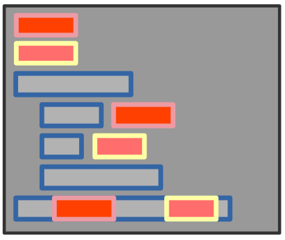
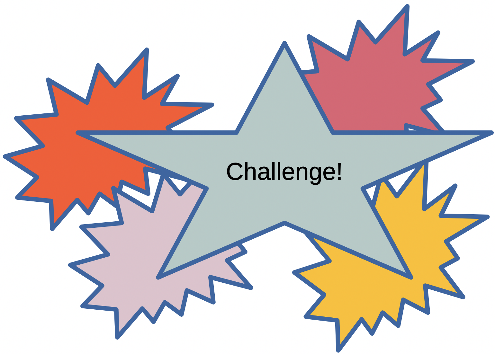
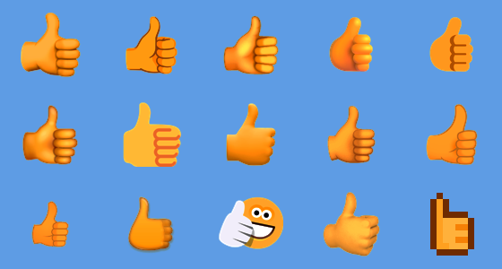

<!-- Find your available themes: ls /Applications/quarto/share/formats/revealjs/themes -->
<!-- ::: {style="color: #2E86C1; font-size: 0.9em; text-align: center; margin-top: 0.5em;"} -->

# Welcome to MORE Python Programming!

::: {.callout-tip}
**Learning smaller parts of code will help you to implement specific types of functionalities in larger projects!**
:::
<center></center>
<center></center>
<center></center>
<center></center>
<center></center>
<center></center>

<center>
{width=50%}
</center>

---

## What are literals, Again??

Let's Return to Literals (e.g., numbers, strings, booleans, etc.) and work with them in interesting ways using `print()`.

::: {.callout-note}
In Python, print statements with an `f` prefix before the opening quotation mark denote f-strings, also known as formatted string literals. F-strings provide a concise and readable way to embed expressions inside string literals for formatting output.
:::

<center>
{width=40%}
</center>


## Python Code Sample with F-strings


::: {.callout-note}
Curiously, both of the below print statements print out the same results, but the code is not the same ...

:::

```python
firstName = "Robert"
lastName = "Paulson"
print(f"His name is: {firstName} {lastName}!") # f for auto formatting
print("His name is:",firstName, lastName,"!") # original structure
```

::: {.callout-output}
Output:

His name is: Robert Paulson!

His name is: Robert Paulson ! # A space appears?!
:::


## Operators

Operators let you do math, compare values, and more!

::: {.callout-important}
**Examples:**

- Arithmetic: `+`, `-`, `*`, `/`, `**` (power)
  
- Comparison: `==`, `!=`, `<`, `>`

- Assignment: `=`, `+=`, `-=`
:::

## Python Code Sample

```python
x = 5
y = 2
sum = x + y
product = x * y
is_equal = (x == y)
x += 1
```
<center>
{width=40%}
</center>

::: {.callout-note}
Variables and operators are the backbone of calculators, games, and simulations!
:::


# Review Python Loops and Conditionals

## Loops

Loops repeat actions. Use `for` and `while` loops.

<center>
{width=50%}
</center>

## Conditionals

Conditionals let your code make decisions using `if`, `elif`, and `else`.

::: {.callout-medium}
**Examples:**
```python
for i in range(5):
	print(i)

count = 0
while count < 3:
	print("Counting:", count)
	count += 1 
	# Do not forget to increment 
	# the counter, or you will create an infinite loop!

	if x > y:    # What changes to print statements if x < y ? 
		print("x is greater!")
	elif x == y:
		print("x equals y!")
	else:
		print("x is less!")
```
:::

**Try out this code! Now, make a change and see what happens!**

## Sort of Interesting Application

Loops and conditionals can be used to determine positive, negative numbers, or zeros. Neat-O!

::: {.callout-large}
**Examples:**
``` python
num = 10
if num > 0:
    print("Positive number")
elif num == 0:
    print("Zero")
else:
    print("Negative number")
```
:::

::: {.callout-output}
Output:

Positive
:::


## Nested Conditionals

You can nest loops, one inside the other.

::: {.callout-large}
**Examples:**
``` python
num = 15
if num >= 0:
    if num == 0:
        print("Zero")
    else:
        print("Positive number")
else:
    print("Negative number")
```
:::

::: {.callout-output}
Output:

Positive
:::

## Logical Operator
Logical operators use `True` and `False` to determine outcomes.

::: {.callout-large}
**Examples:**
``` python
a = 10
b = 20
if a > 5 and b > 15:
    print("Both conditions are true")
if a > 5 or b < 15:
    print("At least one condition is true")
if not a < 5:
    print("a is not less than 5")
```
:::

::: {.callout-output}
Output:

Both conditions are true
At least one condition is true
a is not less than 5
:::


## String Manipulation
We now look at how we can manipulate strings

::: {.callout-large}
**Examples:**
``` python
text = "Hello, World!"
print(text.lower())  # hello, world!
print(text.upper())  # HELLO, WORLD!
print(text.replace("World", "Python"))  # Hello, Python!
print(text.split(", "))  # ['Hello', 'World!']
print(text.strip("!"))  # Hello, World
```
:::

<!-- ::: {.callout-output}
Output:
::: -->

## Lists

- A list is a fundamental data structure in Python used to store an ordered collection of items.

- Lists maintain the order of elements, with each item accessible by its index (starting from 0).

-  Lists are mutable, so their contents can be changed after creation (items can be added, removed, or modified).

- Lists can hold items of different data types, including other lists.

- Lists are created using square brackets, with elements separated by commas.


## Demo of Lists

::: {.callout-large}
**Examples:**
``` python
my_list = [1, 2, 3, 4, 5] # definition
print(my_list[0])  # Access first element
my_list.append(6)  # Add an element to the end
print(my_list)  # [1, 2, 3, 4, 5, 6]
my_list.remove(3)  # Remove element with value 3
print(my_list)  # [1, 2, 4, 5, 6]
print(len(my_list))  # Length of the list
```

::: {.callout-output}
Output:

1

[1, 2, 3, 4, 5, 6]

[1, 2, 4, 5, 6]

5
:::

:::


## Dictionaries
A dictionary is a built-in data structure in Python used to store key-value pairs.

Dictionaries are unordered collections (as of Python 3.6+, they maintain insertion order), where each value is accessed using its unique key.

Dictionaries are mutable, so their contents can be changed after creation (items can be added, removed, or modified).

Keys in a dictionary must be unique and immutable (such as strings, numbers, or tuples), while values can be of any data type.

Dictionaries are created using curly braces {}, with key-value pairs separated by commas and a colon between each key and value.

## Demo of Dictionaries

::: {.callout-large}
**Examples:**
``` python
my_dict = {"name": "Alice", "age": 25, "is_student": True}  # definition
print(my_dict["name"])  # Access value by key
my_dict["age"] = 26  # Modify value
my_dict["city"] = "New York"  # Add new key-value pair
print(my_dict)  # {'name': 'Alice', 'age': 26, 'is_student': True, 'city': 'New York'}
del my_dict["is_student"]  # Remove a key-value pair
print(my_dict)  # {'name': 'Alice', 'age': 26, 'city': 'New York'}
print(len(my_dict))  # Number of key-value pairs
```


::: {.callout-output}
Output:

Alice

{'name': 'Alice', 'age': 26, 'is_student': True, 'city': 'New York'}

{'name': 'Alice', 'age': 26, 'city': 'New York'}

3
:::

:::

---

## Coding Challenges

<center>
{width=90%}
</center>

### 1. Variables and Operators
**Challenge:**  
Create two variables, `a` and `b`, assign them integer values, and print their sum, difference, product, and quotient.

<!-- <center>
{width=30%}
</center> -->

::: {.callout-tip}
**Method Suggestions:**

- Declare two variables and assign integer values to them
- Use arithmetic operators: `+`, `-`, `*`, `/`
- Use `print()` function with labels for clarity
- Consider using f-strings for formatted output
- Remember: division `/` gives a float result
:::

---

### 2. Working with Lists
**Challenge:**  
Create a list of five numbers. Print the largest number in the list.

<!-- <center>
{width=30%}
</center> -->

::: {.callout-tip}
**Method Suggestions:**

- Create a list using square brackets `[]`
- Use the built-in `max()` function
- Alternative: Sort the list and access the last element
- Another option: Loop through and compare each element
- Consider using `print()` with a descriptive message
:::

---

### 3. Dictionaries
**Challenge:**  
Create a dictionary with three key-value pairs representing a person's name, age, and city. Print each key and its value.

<!-- <center>
{width=30%}
</center> -->

::: {.callout-tip}
**Method Suggestions:**

- Use curly braces `{}` to create a dictionary
- Use the `.items()` method to access key-value pairs
- Loop through the dictionary with `for key, value in dict.items()`
- Alternative: Access keys with `.keys()` and values with `.values()`
- You can also print individual items by accessing keys directly
:::

---

### 4. For Loops
**Challenge:**  
Use a for loop to print all even numbers from 1 to 10.

<!-- <center>
{width=35%}
</center> -->

::: {.callout-tip}
**Method Suggestions:**

- Use `range(1, 11)` to iterate from 1 to 10
- Check if a number is even using the modulo operator `%`
- Alternative: Use `range()` with a step parameter
- Another option: Use list comprehension
- Remember: `i % 2 == 0` tests for even numbers
:::

---

### 5. While Loops and Conditionals
**Challenge:**  
Use a while loop to keep asking the user to enter a number until they enter a negative number.

<!-- <center>
{width=35%}
</center> -->

::: {.callout-tip}
**Method Suggestions:**

- Use `while True:` for a continuous loop
- Get user input with `input()` function
- Convert input to integer using `int()`
- Use `break` statement to exit the loop
- Alternative: Use a condition in the while loop itself
- Check if number is negative with `< 0` comparison
:::

---

# Interactive Challenges

Test your understanding before checking the solutions! Click an answer to see if you're right.

<center>
{width=50%}
</center>

## Challenge Q1: The Mysterious Space 🕵️

```{=html}
<div class="quiz-box">
  <div class="quiz-question">Why does <code>print("His name is:", firstName, lastName, "!")</code> print an extra space before the exclamation mark, unlike the f-string version?</div>

  <div class="quiz-options">
    <div class="quiz-option" onclick="checkChallengeR1(this, false)">It's a bug in Python</div>
    <div class="quiz-option" onclick="checkChallengeR1(this, true)">print() inserts a space between every comma-separated argument by default</div>
    <div class="quiz-option" onclick="checkChallengeR1(this, false)">Strings always have trailing spaces</div>
    <div class="quiz-option" onclick="checkChallengeR1(this, false)">lastName has a hidden space in it</div>
  </div>

  <div id="challengeR1-feedback" style="display: none;"></div>
</div>

<script>
function checkChallengeR1(element, isCorrect) {
  element.parentElement.querySelectorAll('.quiz-option').forEach(opt => opt.classList.remove('correct', 'incorrect'));
  element.classList.add(isCorrect ? 'correct' : 'incorrect');

  const feedback = document.getElementById('challengeR1-feedback');
  feedback.style.display = 'block';
  feedback.className = 'quiz-feedback ' + (isCorrect ? 'correct' : 'incorrect');

  if (isCorrect) {
    feedback.textContent = '✅ Correct! print() joins comma-separated arguments with a single space (sep=" ") by default, so "!" gets a space before it too.';
  } else {
    feedback.textContent = '❌ Try again! It comes down to how print() handles commas — it inserts a space between each argument automatically.';
  }
}
</script>
```

---

## Challenge Q2: Score Booster 🎮

```{=html}
<div class="quiz-box">
  <div class="quiz-question">In a video game, <code>score = 10</code>. After running <code>score += 5</code>, what is the value of <code>score</code>?</div>

  <div class="quiz-options">
    <div class="quiz-option" onclick="checkChallengeR2(this, false)">10</div>
    <div class="quiz-option" onclick="checkChallengeR2(this, false)">5</div>
    <div class="quiz-option" onclick="checkChallengeR2(this, true)">15</div>
    <div class="quiz-option" onclick="checkChallengeR2(this, false)">Error: += is not valid Python</div>
  </div>

  <div id="challengeR2-feedback" style="display: none;"></div>
</div>

<script>
function checkChallengeR2(element, isCorrect) {
  element.parentElement.querySelectorAll('.quiz-option').forEach(opt => opt.classList.remove('correct', 'incorrect'));
  element.classList.add(isCorrect ? 'correct' : 'incorrect');

  const feedback = document.getElementById('challengeR2-feedback');
  feedback.style.display = 'block';
  feedback.className = 'quiz-feedback ' + (isCorrect ? 'correct' : 'incorrect');

  if (isCorrect) {
    feedback.textContent = '✅ Correct! score += 5 is shorthand for score = score + 5, so 10 + 5 = 15.';
  } else {
    feedback.textContent = '❌ Not quite! The += operator adds to the existing value: score = score + 5 means 10 + 5 = 15.';
  }
}
</script>
```

---

## Challenge Q3: Countdown Blaster 🚀

```{=html}
<div class="quiz-box">
  <div class="quiz-question">What is the last value printed by this countdown loop? <code>count = 3<br>while count > 0:<br>&nbsp;&nbsp;&nbsp;&nbsp;print(count)<br>&nbsp;&nbsp;&nbsp;&nbsp;count -= 1</code></div>

  <div class="quiz-options">
    <div class="quiz-option" onclick="checkChallengeR3(this, false)">0</div>
    <div class="quiz-option" onclick="checkChallengeR3(this, true)">1</div>
    <div class="quiz-option" onclick="checkChallengeR3(this, false)">3</div>
    <div class="quiz-option" onclick="checkChallengeR3(this, false)">The loop never ends</div>
  </div>

  <div id="challengeR3-feedback" style="display: none;"></div>
</div>

<script>
function checkChallengeR3(element, isCorrect) {
  element.parentElement.querySelectorAll('.quiz-option').forEach(opt => opt.classList.remove('correct', 'incorrect'));
  element.classList.add(isCorrect ? 'correct' : 'incorrect');

  const feedback = document.getElementById('challengeR3-feedback');
  feedback.style.display = 'block';
  feedback.className = 'quiz-feedback ' + (isCorrect ? 'correct' : 'incorrect');

  if (isCorrect) {
    feedback.textContent = '✅ Correct! The loop prints 3, 2, then 1. Once count becomes 0, count > 0 is False and the loop stops before printing 0.';
  } else {
    feedback.textContent = '❌ Try again! The loop keeps running while count > 0. It prints 3, then 2, then 1 — and stops as soon as count hits 0.';
  }
}
</script>
```

---

## Challenge Q4: Movie Title Makeover 🎬

```{=html}
<div class="quiz-box">
  <div class="quiz-question">Given <code>title = "star wars: a new hope"</code>, which method call converts it to <code>"STAR WARS: A NEW HOPE"</code>?</div>

  <div class="quiz-options">
    <div class="quiz-option" onclick="checkChallengeR4(this, false)">title.capitalize()</div>
    <div class="quiz-option" onclick="checkChallengeR4(this, true)">title.upper()</div>
    <div class="quiz-option" onclick="checkChallengeR4(this, false)">title.strip()</div>
    <div class="quiz-option" onclick="checkChallengeR4(this, false)">title.split()</div>
  </div>

  <div id="challengeR4-feedback" style="display: none;"></div>
</div>

<script>
function checkChallengeR4(element, isCorrect) {
  element.parentElement.querySelectorAll('.quiz-option').forEach(opt => opt.classList.remove('correct', 'incorrect'));
  element.classList.add(isCorrect ? 'correct' : 'incorrect');

  const feedback = document.getElementById('challengeR4-feedback');
  feedback.style.display = 'block';
  feedback.className = 'quiz-feedback ' + (isCorrect ? 'correct' : 'incorrect');

  if (isCorrect) {
    feedback.textContent = '✅ Correct! The .upper() method converts every letter in a string to uppercase.';
  } else {
    feedback.textContent = '❌ Not quite! To make every letter uppercase, use the .upper() string method.';
  }
}
</script>
```

---

## Challenge Q5: Inventory Update 🎒

```{=html}
<div class="quiz-box">
  <div class="quiz-question">A game inventory is <code>inventory = {"gold": 50, "gems": 3}</code>. After <code>inventory["gold"] += 20</code>, what is <code>inventory["gold"]</code>?</div>

  <div class="quiz-options">
    <div class="quiz-option" onclick="checkChallengeR5(this, false)">20</div>
    <div class="quiz-option" onclick="checkChallengeR5(this, false)">50</div>
    <div class="quiz-option" onclick="checkChallengeR5(this, true)">70</div>
    <div class="quiz-option" onclick="checkChallengeR5(this, false)">Error: cannot use += on dictionary values</div>
  </div>

  <div id="challengeR5-feedback" style="display: none;"></div>
</div>

<script>
function checkChallengeR5(element, isCorrect) {
  element.parentElement.querySelectorAll('.quiz-option').forEach(opt => opt.classList.remove('correct', 'incorrect'));
  element.classList.add(isCorrect ? 'correct' : 'incorrect');

  const feedback = document.getElementById('challengeR5-feedback');
  feedback.style.display = 'block';
  feedback.className = 'quiz-feedback ' + (isCorrect ? 'correct' : 'incorrect');

  if (isCorrect) {
    feedback.textContent = '✅ Correct! Dictionary values can be updated with +=, just like variables: 50 + 20 = 70.';
  } else {
    feedback.textContent = '❌ Try again! inventory["gold"] += 20 adds 20 to the current value: 50 + 20 = 70.';
  }
}
</script>
```


# Solutions

<center>
{width=50%}
</center>

---

## Solution 1: Variables and Operators (Part 1)

**Challenge:** Create two variables, assign them integer values, and print their sum, difference, product, and quotient.

::: {.callout-note}
**Approach 1: Basic Print Statements**

```python
a = 10
b = 5
print("Sum:", a + b)
print("Difference:", a - b)
print("Product:", a * b)
print("Quotient:", a / b)
```
:::

::: {.callout-note}
**Approach 2: Using F-strings**

```python
a = 10
b = 5
print(f"Sum: {a + b}")
print(f"Difference: {a - b}")
print(f"Product: {a * b}")
print(f"Quotient: {a / b}")
```
:::


## Solution 1: Variables and Operators (Part 2)

**Challenge:** Create two variables, assign them integer values, and print their sum, difference, product, and quotient.

::: {.callout-note}
**Approach 3: Storing Results in Variables**

```python
a = 10
b = 5
sum_result = a + b
diff_result = a - b
prod_result = a * b
quot_result = a / b
print(f"Sum: {sum_result}, Difference: {diff_result}, Product: {prod_result}, Quotient: {quot_result}")
```
:::

---

## Solution 2: Working with Lists (Part 1)

**Challenge:** Create a list of five numbers and print the largest number.

::: {.callout-note}
**Approach 1: Using max() Function**
```python
numbers = [3, 7, 2, 9, 5]
print("Largest number:", max(numbers))
```
:::

::: {.callout-note}
**Approach 2: Sorting the List**
```python
numbers = [3, 7, 2, 9, 5]
numbers.sort()
print("Largest number:", numbers[-1])  # Last element after sorting
```
:::

---

## Solution 2: Working with Lists (Part 2)

**Challenge:** Create a list of five numbers and print the largest number.

::: {.callout-note}
**Approach 3: Manual Comparison Loop**
```python
numbers = [3, 7, 2, 9, 5]
largest = numbers[0]
for num in numbers:
    if num > largest:
        largest = num
print("Largest number:", largest)
```
:::

::: {.callout-note}
**Approach 4: Using sorted() Function**
```python
numbers = [3, 7, 2, 9, 5]
largest = sorted(numbers)[-1]
print("Largest number:", largest)
```
:::

---

## Solution 3: Dictionaries (Part 1)

**Challenge:** Create a dictionary with three key-value pairs and print each key and value.

<!-- <center>
{width=25%}
</center> -->

::: {.callout-note}
**Approach 1: Using .items() Method**

```python
person = {"name": "Alice", "age": 25, "city": "New York"}
for key, value in person.items():
    print(key, ":", value)
```
:::

::: {.callout-note}
**Approach 2: Using F-strings**

```python
person = {"name": "Alice", "age": 25, "city": "New York"}
for key, value in person.items():
    print(f"{key}: {value}")
```
:::

---

## Solution 3: Dictionaries (Part 2)

**Challenge:** Create a dictionary with three key-value pairs and print each key and value.

::: {.callout-note}
**Approach 3: Accessing Keys Directly**

```python
person = {"name": "Alice", "age": 25, "city": "New York"}
for key in person.keys():
    print(f"{key}: {person[key]}")
```
:::

::: {.callout-note}
**Approach 4: Individual Print Statements**

```python
person = {"name": "Alice", "age": 25, "city": "New York"}
print("name:", person["name"])
print("age:", person["age"])
print("city:", person["city"])
```
:::

---

## Solution 4: For Loops (Part 1)

**Challenge:** Use a for loop to print all even numbers from 1 to 10.

::: {.callout-note}
**Approach 1: Using Modulo Operator**

```python
for i in range(1, 11):
    if i % 2 == 0:
        print(i)
```
:::

::: {.callout-note}
**Approach 2: Using Range with Step**

```python
for i in range(2, 11, 2):  # Start at 2, step by 2
    print(i)
```
:::

---

## Solution 4: For Loops (Part 2)

**Challenge:** Use a for loop to print all even numbers from 1 to 10.

<!-- <center>
{width=30%}
</center> -->

::: {.callout-note}
**Approach 3: Using List Comprehension**

```python
even_numbers = [i for i in range(1, 11) if i % 2 == 0]
for num in even_numbers:
    print(num)
```
:::

::: {.callout-note}
**Approach 4: One-liner with List Comprehension**

```python
print(*[i for i in range(1, 11) if i % 2 == 0], sep='\n')
```
:::

---

## Solution 5: While Loops and Conditionals (Part 1)

**Challenge:** Use a while loop to keep asking for input until a negative number is entered.

<!-- <center>
{width=25%}
</center> -->

::: {.callout-note}
**Approach 1: Using break Statement**
```python
while True:
    num = int(input("Enter a number: "))
    if num < 0:
        break
```
:::

::: {.callout-note}
**Approach 2: Using Condition in While Loop**

```python
num = 0  # Initialize with a non-negative number
while num >= 0:
    num = int(input("Enter a number: "))
```
:::

---

## Solution 5: While Loops and Conditionals (Part 2)

**Challenge:** Use a while loop to keep asking for input until a negative number is entered.

::: {.callout-note}
**Approach 3: With Feedback Messages**

```python
while True:
    num = int(input("Enter a number (negative to quit): "))
    if num < 0:
        print("Negative number entered. Exiting...")
        break
    else:
        print(f"You entered: {num}")
```
:::

::: {.callout-note}
**Approach 4: Using Flag Variable**

```python
continue_input = True
while continue_input:
    num = int(input("Enter a number: "))
    if num < 0:
        continue_input = False
```
:::

## You've Got This!!

<center>
{width="45%"}
</center>

::: {.callout-tip icon="true"}
You now able to use ...

* Literals
* Print statements
* Loops driven by `for` and `while`
* Lists and Dictionaries
* Much more!
:::

---


