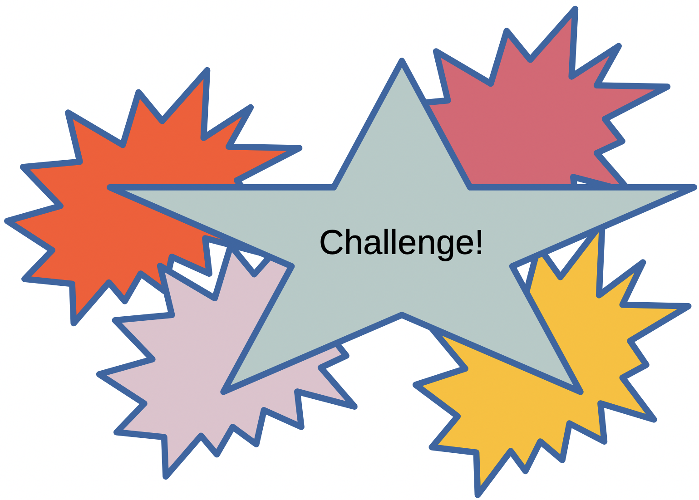

<!-- Find your available themes: ls /Applications/quarto/share/formats/revealjs/themes -->
<!-- ::: {style="color: #2E86C1; font-size: 0.9em; text-align: center; margin-top: 0.5em;"} -->

# On For Today

::: {.callout-tip icon="true"}
## Two Essential Python Skills for Real Programs
**Topics covered in today's discussion:**

* 🧱 **Object-Oriented Programming (OOP)** — classes, objects, methods, and design
* 🧱 **Constructors and Instance State** — using `__init__` and `self`
* 🧱 **Encapsulation & Validation** — controlling how data is updated
* 🧱 **Inheritance & Polymorphism** — reusing and extending behavior
* ⚠️ **Exceptions** — handling runtime errors safely
* ⚠️ **`try` / `except` / `else` / `finally`** — structured error handling
* ⚠️ **Raising Custom Exceptions** — communicating meaningful failures
* 🧠 **Challenge Problems + Solutions** — practice and mechanism-focused discussion
:::

::: {.callout-note}
By the end, you should be able to design small object-based systems and make them resilient when things go wrong.
:::

<!-- <center></center>
<center></center>
<center></center>
<center></center>

<center>
{width=30%}
</center> -->


---

# Part 1: Object-Oriented Programming

::: {.callout-note icon="false"}
## What Is OOP?
**Object-oriented programming** organizes code around **objects** (instances) created from **classes** (blueprints).

A class groups together:

1. **Attributes** (data), and
2. **Methods** (functions that operate on that data).
:::

::: {style="color: #8E44AD;"}
**Key idea:** OOP helps model real systems by bundling data + behavior together.
:::

## Your First Class

::: {.callout-important icon="false"}
## Class, Constructor, Method
```python
class Book:
    def __init__(self, title, author, pages):
        self.title = title
        self.author = author
        self.pages = pages

    def summary(self):
        return f"'{self.title}' by {self.author} ({self.pages} pages)"

b1 = Book("Python Basics", "A. Rivera", 240)
b2 = Book("Data Stories", "L. Chen", 180)

print(b1.summary())
print(b2.title)
```
:::

::: {.callout-important icon="false"}
**How it works:** `Book(...)` calls `__init__` automatically. Each created object stores its own `title`, `author`, and `pages`.

:::

## Instance State with `self`

::: {.callout-important icon="false"}
## Each Object Keeps Its Own Data
```python
class Counter:
    def __init__(self):
        self.value = 0

    def increment(self):
        self.value += 1

    def reset(self):
        self.value = 0

c1 = Counter()
c2 = Counter()

#combine two statements into one line
c1.increment(); c1.increment() 

c2.increment()

print(f"c1.value is {c1.value}")  # 2
print(f"c2.value is {c2.value}")  # 1
```

`self` refers to the current object, so `c1` and `c2` do not overwrite each other.
:::

## Challenge: Independent Object State

```{=html}
<div class="quiz-box" data-correct="Correct! Each Counter instance has its own value. c1 was incremented twice, so c1.value is 2." >
    <div class="quiz-question">After creating <code>c1</code> and <code>c2</code> as separate <code>Counter</code> objects, the program calls <code>c1.increment()</code> twice and <code>c2.increment()</code> once. What is <code>c1.value</code>?</div>
    <div class="quiz-options">
        <div class="quiz-option" onclick="checkOopExceptionsQuiz(this, false)" data-hint="That is c2.value. Each object keeps its own instance state.">1</div>
        <div class="quiz-option" onclick="checkOopExceptionsQuiz(this, true)" data-hint="">2</div>
        <div class="quiz-option" onclick="checkOopExceptionsQuiz(this, false)" data-hint="The values are not added together; c1 only tracks calls made on c1.">3</div>
        <div class="quiz-option" onclick="checkOopExceptionsQuiz(this, false)" data-hint="The constructor initializes value to 0, but c1.increment() changes it each time.">0</div>
    </div>
    <div class="quiz-feedback" style="display: none;" aria-live="polite"></div>
</div>
```

<center>
{width=30%}
</center>

## Encapsulation and Validation

::: {.callout-important icon="false"}
## Guarding Against Invalid Updates
```python
class Temperature:
    def __init__(self, celsius=0):
        self.set_celsius(celsius)

    def set_celsius(self, value):
        if value < -273.15:
            raise ValueError("Temperature cannot be below absolute zero.")
        self._celsius = value

    def get_celsius(self):
        return self._celsius

    def to_fahrenheit(self):
        return (self._celsius * 9 / 5) + 32

room = Temperature(21)
print(room.to_fahrenheit())
```
:::

::: {.callout-note icon="false"}
The attribute `_celsius` is a convention for “internal use.” Public methods (`set_celsius`, `get_celsius`) enforce valid state.
:::

## Challenge: Validation During Construction

```{=html}
<div class="quiz-box" data-correct="Correct! Temperature.__init__ calls set_celsius, which raises ValueError for a value below -273.15. No invalid Temperature object is created.">
    <div class="quiz-question">What happens when the temperature conversion program evaluates <code>room = Temperature(-300)</code> using the previous code?</div>
    <div class="quiz-options">
        <div class="quiz-option" onclick="checkOopExceptionsQuiz(this, false)" data-hint="The setter does not clamp or repair the value; it rejects values below absolute zero.">A Temperature object is created with -273.15 degrees.</div>
        <div class="quiz-option" onclick="checkOopExceptionsQuiz(this, true)" data-hint="">A ValueError is raised before a valid object is created.</div>
        <div class="quiz-option" onclick="checkOopExceptionsQuiz(this, false)" data-hint="The comparison works for numbers. Check which exception the setter explicitly raises.">A TypeError is raised because negative numbers are not allowed.</div>
        <div class="quiz-option" onclick="checkOopExceptionsQuiz(this, false)" data-hint="The constructor routes the initial value through set_celsius, so validation runs immediately.">The object is created and the invalid value is stored.</div>
    </div>
    <div class="quiz-feedback" style="display: none;" aria-live="polite"></div>
</div>
```

<center>
{width=30%}
</center>


## `__str__` for Readable Objects

::: {.callout-important icon="false"}
## Custom Print Output
```python
class Student:
    def __init__(self, name, grade):
        self.name = name
        self.grade = grade

    def __str__(self):
        return f"Student(name={self.name}, grade={self.grade})"

    def is_passing(self):
        return self.grade >= 60

s = Student("Maya", 88)
print(s)
print(s.is_passing())
```
:::

## Inheritance: Reusing a Base Class

::: {.callout-important icon="false"}
## A Base Class and Two Subclasses
```python
class Animal:
    def __init__(self, name):
        self.name = name

    def speak(self):
        return "..."

class Dog(Animal):
    def speak(self):
        return f"{self.name} says woof!"

class Cat(Animal):
    def speak(self):
        return f"{self.name} says meow!"

pets = [Dog("Buddy"), Cat("Luna")]
for pet in pets:
    print(pet.speak())
```
:::

::: {.callout-note icon="false"}
This is **polymorphism**: same method call (`speak`) produces behavior based on object type.
:::

## Challenge: Polymorphic Method Calls

```{=html}
<div class="quiz-box" data-correct="Correct! The loop calls speak() on each object. Python uses the method implementation belonging to that object's class.">
    <div class="quiz-question">Given <code>pets = [Dog("Buddy"), Cat("Luna")]</code>, what does <code>pet.speak()</code> produce for each pet in a loop?</div>
    <div class="quiz-options">
        <div class="quiz-option" onclick="checkOopExceptionsQuiz(this, false)" data-hint="Dog and Cat each override speak(), so both objects do not use the base class implementation.">Buddy says ... then Luna says ...</div>
        <div class="quiz-option" onclick="checkOopExceptionsQuiz(this, false)" data-hint="The method call is the same, but the implementation depends on each object's type.">Buddy says meow then Luna says woof</div>
        <div class="quiz-option" onclick="checkOopExceptionsQuiz(this, true)" data-hint="">Buddy says woof then Luna says meow</div>
        <div class="quiz-option" onclick="checkOopExceptionsQuiz(this, false)" data-hint="Both classes define speak(), so the objects can respond differently without an explicit type check.">The loop raises an error because Dog and Cat have different classes</div>
    </div>
    <div class="quiz-feedback" style="display: none;" aria-live="polite"></div>
</div>
```

<center>
{width=30%}
</center>

## Composition: Objects Inside Objects

::: {.callout-important icon="false"}
## Modeling Relationships with Contained Objects
```python
class Engine:
    def __init__(self, horsepower):
        self.horsepower = horsepower

class Car:
    def __init__(self, brand, horsepower):
        self.brand = brand
        self.engine = Engine(horsepower)

    def info(self):
        return f"{self.brand} with {self.engine.horsepower} HP"

car = Car("Toyota", 169)
print(car.info())
```

**Design point:** Composition often models “has-a” relationships cleanly (`Car` has an `Engine`).
:::


## Lets Build a Class Together

<center>
{width=50%}
</center>

## Class Forge: Build a D&D Character


::: {.callout icon="false"}

Choose a class name and starting stats, then add your own instance attributes and methods. The Python source updates as you build; the comments point out where class syntax and `self` appear.

:::

```{=html}
<div id="class-forge" class="class-forge">
    <div class="forge-layout">
        <div class="forge-controls" aria-label="Character class settings">
            <div class="forge-fields">
                <label>Class name
                    <input id="forge-class-name" type="text" value="Adventurer" autocomplete="off">
                </label>
                <label>Character name
                    <input id="forge-character-name" type="text" value="Mira" autocomplete="off">
                </label>
                <label>Starting hit points
                    <input id="forge-hit-points" type="number" value="24" min="1" max="999">
                </label>
                <label>Strength
                    <input id="forge-strength" type="number" value="6" min="1" max="99">
                </label>
            </div>

            <div class="forge-subsection">
                <h3>Instance attributes</h3>
                <p>Each added attribute becomes a constructor parameter and a <code>self.attribute</code> assignment.</p>
                <div id="forge-attributes" class="forge-attributes"></div>
                <button id="forge-add-attribute" class="forge-button forge-secondary" type="button">+ Add attribute</button>
            </div>

            <fieldset class="forge-subsection forge-methods">
                <legend>Methods to include</legend>
                <label><input id="forge-method-attack" type="checkbox" checked> <code>attack(target)</code></label>
                <label><input id="forge-method-damage" type="checkbox" checked> <code>take_damage(amount)</code></label>
                <label><input id="forge-method-heal" type="checkbox"> <code>heal(amount=5)</code></label>
            </fieldset>

            <div class="forge-actions">
                <button id="forge-copy" class="forge-button forge-primary" type="button">Copy Python code</button>
                <button id="forge-reset" class="forge-button forge-secondary" type="button">Reset</button>
            </div>
            <div id="forge-status" class="forge-status" role="status" aria-live="polite"></div>
        </div>

        <div class="forge-output" aria-label="Generated Python code">
            <h3>Generated Python</h3>
            <pre class="forge-code"><code id="forge-code"></code></pre>
        </div>
    </div>

    <div class="forge-playtest" aria-label="Character combat preview">
        <div class="forge-playtest-heading">
            <div>
                <h3>Combat preview</h3>
                <p>This small browser preview mirrors the class settings; it does not execute Python.</p>
            </div>
            <div class="forge-actions">
                <button id="forge-hero-attack" class="forge-button forge-primary" type="button">Attack goblin</button>
                <button id="forge-goblin-attack" class="forge-button forge-secondary" type="button">Goblin attacks</button>
                <button id="forge-heal" class="forge-button forge-secondary" type="button">Heal character</button>
            </div>
        </div>
        <div class="forge-health" aria-live="polite">
            <span id="forge-hero-health"></span>
            <span id="forge-goblin-health"></span>
        </div>
        <div id="forge-combat-log" class="forge-combat-log" role="status" aria-live="polite">Choose a method and start the encounter.</div>
    </div>
</div>

<script>
(() => {
    const root = document.getElementById('class-forge');
    if (!root) return;

    // Tune every builder button in custom_big_o.css with --forge-button-font-size.
    const reservedNames = new Set([
        'False', 'None', 'True', 'and', 'as', 'assert', 'async', 'await', 'break',
        'class', 'continue', 'def', 'del', 'elif', 'else', 'except', 'finally',
        'for', 'from', 'global', 'if', 'import', 'in', 'is', 'lambda', 'nonlocal',
        'not', 'or', 'pass', 'raise', 'return', 'try', 'while', 'with', 'yield'
    ]);
    const protectedAttributes = new Set([
        'name', 'hit_points', 'max_hit_points', 'strength', 'attack', 'take_damage', 'heal'
    ]);

    let heroHealth = 0;
    let goblinHealth = 0;

    function addAttribute(name = 'quest_item', value = 'moonstone', type = 'text') {
        const row = document.createElement('div');
        row.className = 'forge-attribute-row';

        const nameLabel = document.createElement('label');
        nameLabel.textContent = 'Name';
        const nameInput = document.createElement('input');
        nameInput.className = 'forge-attribute-name';
        nameInput.type = 'text';
        nameInput.value = name;
        nameInput.autocomplete = 'off';
        nameInput.setAttribute('aria-label', 'New attribute name');
        nameLabel.append(nameInput);

        const valueLabel = document.createElement('label');
        valueLabel.textContent = 'Default value';
        const valueInput = document.createElement('input');
        valueInput.className = 'forge-attribute-value';
        valueInput.type = 'text';
        valueInput.value = value;
        valueInput.setAttribute('aria-label', 'New attribute default value');
        valueLabel.append(valueInput);

        const typeLabel = document.createElement('label');
        typeLabel.textContent = 'Type';
        const typeSelect = document.createElement('select');
        typeSelect.className = 'forge-attribute-type';
        typeSelect.setAttribute('aria-label', 'New attribute value type');
        [['text', 'Text'], ['number', 'Number'], ['boolean', 'Boolean']].forEach(([optionValue, label]) => {
            const option = document.createElement('option');
            option.value = optionValue;
            option.textContent = label;
            typeSelect.append(option);
        });
        typeSelect.value = type;
        typeLabel.append(typeSelect);

        const removeButton = document.createElement('button');
        removeButton.className = 'forge-button forge-remove-attribute';
        removeButton.type = 'button';
        removeButton.textContent = 'Remove';
        removeButton.setAttribute('aria-label', 'Remove this attribute');

        row.append(nameLabel, valueLabel, typeLabel, removeButton);
        root.querySelector('#forge-attributes').append(row);
    }

    function pythonString(value) {
        return JSON.stringify(value);
    }

    function readSettings() {
        const className = root.querySelector('#forge-class-name').value.trim();
        const characterName = root.querySelector('#forge-character-name').value.trim() || 'Hero';
        const hitPoints = Number(root.querySelector('#forge-hit-points').value);
        const strength = Number(root.querySelector('#forge-strength').value);
        const methodAttack = root.querySelector('#forge-method-attack').checked;
        const methodDamage = root.querySelector('#forge-method-damage').checked;
        const methodHeal = root.querySelector('#forge-method-heal').checked;
        const attributes = [];
        const names = new Set(protectedAttributes);

        if (!/^[A-Za-z_][A-Za-z0-9_]*$/.test(className) || reservedNames.has(className)) {
            return { error: 'Use a valid Python class name (letters, numbers, and underscores; do not start with a number).', className };
        }
        if (!Number.isInteger(hitPoints) || hitPoints < 1 || !Number.isInteger(strength) || strength < 1) {
            return { error: 'Hit points and strength must be positive whole numbers.', className };
        }

        for (const row of root.querySelectorAll('.forge-attribute-row')) {
            const name = row.querySelector('.forge-attribute-name').value.trim();
            const rawValue = row.querySelector('.forge-attribute-value').value;
            const type = row.querySelector('.forge-attribute-type').value;
            if (!/^[A-Za-z_][A-Za-z0-9_]*$/.test(name) || reservedNames.has(name)) {
                return { error: 'Attribute names must be valid Python identifiers.', className };
            }
            if (names.has(name)) {
                return { error: 'Attribute names must be unique and cannot replace a built-in character field or method.', className };
            }
            names.add(name);

            let value;
            if (type === 'number') {
                value = Number(rawValue);
                if (rawValue.trim() === '' || !Number.isFinite(value)) {
                    return { error: `Enter a number for the ${name} attribute.`, className };
                }
            } else if (type === 'boolean') {
                if (rawValue !== 'True' && rawValue !== 'False') {
                    return { error: `Use True or False for the ${name} attribute.`, className };
                }
                value = rawValue;
            } else {
                value = pythonString(rawValue);
            }
            attributes.push({ name, value });
        }

        return { className, characterName, hitPoints, strength, methodAttack, methodDamage, methodHeal, attributes };
    }

    function generatePython(settings) {
        const parameters = settings.attributes.map(attribute => `${attribute.name}=${attribute.value}`);
        const constructorParameters = ['name', 'hit_points=24', 'strength=6', ...parameters].join(', ');
        const heroArguments = [pythonString(settings.characterName), `hit_points=${settings.hitPoints}`, `strength=${settings.strength}`, ...parameters].join(', ');
        const enemyHitPoints = Math.min(12, settings.hitPoints);
        const enemyStrength = Math.max(1, Math.floor(settings.strength / 2));
        const enemyArguments = ["'Goblin'", `hit_points=${enemyHitPoints}`, `strength=${enemyStrength}`, ...parameters].join(', ');
        const lines = [
            `class ${settings.className}:`,
            '    """A character blueprint: each instance has its own state."""',
            `    def __init__(self, ${constructorParameters}):`,
            '        # self refers to the particular character being initialized.',
            '        self.name = name',
            '        self.max_hit_points = hit_points',
            '        self.hit_points = hit_points',
            '        self.strength = strength',
            ...settings.attributes.map(attribute => `        self.${attribute.name} = ${attribute.name}`)
        ];

        if (settings.methodAttack) {
            lines.push('', '    def attack(self, target):', '        """Use this character\'s strength against another object."""', '        target.take_damage(self.strength)', '        return f"{self.name} attacks {target.name}!"');
        }
        if (settings.methodDamage) {
            lines.push('', '    def take_damage(self, amount):', '        # Clamp health at zero so hit points never become negative.', '        self.hit_points = max(0, self.hit_points - amount)');
        }
        if (settings.methodHeal) {
            lines.push('', '    def heal(self, amount=5):', '        # Do not heal past the starting maximum.', '        self.hit_points = min(self.max_hit_points, self.hit_points + amount)');
        }

        lines.push('', '# Make two separate objects from the same class.', `hero = ${settings.className}(${heroArguments})`, `goblin = ${settings.className}(${enemyArguments})`);
        if (settings.methodAttack && settings.methodDamage) {
            lines.push('', '# Calling the same method on different objects uses their own state.', 'print(hero.attack(goblin))', 'print(f"{goblin.name} has {goblin.hit_points} HP left.")');
        } else {
            lines.push('', '# Add both attack() and take_damage() to enable the combat example.', 'print(f"{hero.name} has {hero.hit_points} HP.")');
        }
        return lines.join('\n');
    }

    function renderGame(settings) {
        const enemyHitPoints = Math.min(12, settings.hitPoints);
        const canFight = settings.methodAttack && settings.methodDamage;
        const heroLabel = root.querySelector('#forge-hero-health');
        const goblinLabel = root.querySelector('#forge-goblin-health');
        const heroButton = root.querySelector('#forge-hero-attack');
        const goblinButton = root.querySelector('#forge-goblin-attack');
        const healButton = root.querySelector('#forge-heal');
        const log = root.querySelector('#forge-combat-log');
        const stateKey = JSON.stringify([settings.characterName, settings.hitPoints, settings.strength, settings.methodAttack, settings.methodDamage, settings.methodHeal]);

        if (root.dataset.gameKey !== stateKey) {
            root.dataset.gameKey = stateKey;
            heroHealth = settings.hitPoints;
            goblinHealth = enemyHitPoints;
            log.textContent = canFight ? 'Both objects are ready. Choose who attacks first.' : 'Enable both attack() and take_damage() to run combat.';
        }

        heroLabel.textContent = `${settings.characterName}: ${heroHealth} / ${settings.hitPoints} HP`;
        goblinLabel.textContent = `Goblin: ${goblinHealth} / ${enemyHitPoints} HP`;
        heroButton.disabled = !canFight || goblinHealth === 0;
        goblinButton.disabled = !canFight || heroHealth === 0;
        healButton.disabled = !settings.methodHeal || heroHealth === settings.hitPoints;
    }

    function updateBuilder() {
        const settings = readSettings();
        const status = root.querySelector('#forge-status');
        const code = root.querySelector('#forge-code');
        if (settings.error) {
            status.textContent = settings.error;
            status.classList.add('forge-error');
            code.textContent = '# Fix the highlighted class settings to generate Python.';
            root.querySelector('#forge-copy').disabled = true;
            root.querySelector('#forge-hero-attack').disabled = true;
            root.querySelector('#forge-goblin-attack').disabled = true;
            root.querySelector('#forge-heal').disabled = true;
            return;
        }

        status.textContent = 'Class syntax looks good.';
        status.classList.remove('forge-error');
        root.querySelector('#forge-copy').disabled = false;
        code.textContent = generatePython(settings);
        renderGame(settings);
    }

    root.addEventListener('input', updateBuilder);
    root.addEventListener('change', updateBuilder);
    root.querySelector('#forge-add-attribute').addEventListener('click', () => {
        addAttribute();
        updateBuilder();
    });
    root.querySelector('#forge-attributes').addEventListener('click', event => {
        if (event.target.closest('.forge-remove-attribute')) {
            event.target.closest('.forge-attribute-row').remove();
            updateBuilder();
        }
    });
    root.querySelector('#forge-copy').addEventListener('click', async () => {
        const status = root.querySelector('#forge-status');
        try {
            await navigator.clipboard.writeText(root.querySelector('#forge-code').textContent);
            status.textContent = 'Python code copied. Paste it into a Python notebook to run it.';
        } catch {
            status.textContent = 'Clipboard access is unavailable here. Select the generated code and copy it.';
        }
    });
    root.querySelector('#forge-reset').addEventListener('click', () => {
        root.querySelector('#forge-class-name').value = 'Adventurer';
        root.querySelector('#forge-character-name').value = 'Mira';
        root.querySelector('#forge-hit-points').value = '24';
        root.querySelector('#forge-strength').value = '6';
        root.querySelector('#forge-method-attack').checked = true;
        root.querySelector('#forge-method-damage').checked = true;
        root.querySelector('#forge-method-heal').checked = false;
        root.querySelector('#forge-attributes').replaceChildren();
        root.dataset.gameKey = '';
        updateBuilder();
    });
    root.querySelector('#forge-hero-attack').addEventListener('click', () => {
        const settings = readSettings();
        if (!settings.error) {
            goblinHealth = Math.max(0, goblinHealth - settings.strength);
            root.querySelector('#forge-combat-log').textContent = `${settings.characterName} attacks Goblin for ${settings.strength}. Goblin has ${goblinHealth} HP left.`;
            renderGame(settings);
        }
    });
    root.querySelector('#forge-goblin-attack').addEventListener('click', () => {
        const settings = readSettings();
        if (!settings.error) {
            const goblinStrength = Math.max(1, Math.floor(settings.strength / 2));
            heroHealth = Math.max(0, heroHealth - goblinStrength);
            root.querySelector('#forge-combat-log').textContent = `Goblin attacks ${settings.characterName} for ${goblinStrength}. ${settings.characterName} has ${heroHealth} HP left.`;
            renderGame(settings);
        }
    });
    root.querySelector('#forge-heal').addEventListener('click', () => {
        const settings = readSettings();
        if (!settings.error && settings.methodHeal) {
            heroHealth = Math.min(settings.hitPoints, heroHealth + 5);
            root.querySelector('#forge-combat-log').textContent = `${settings.characterName} heals 5 HP and now has ${heroHealth} HP.`;
            renderGame(settings);
        }
    });

    updateBuilder();
})();
</script>
```

## Reading and Using Your Class

::: {.callout-important icon="false"}

1. Change the class name, character name, hit points, or strength; the Python source updates immediately.
2. Select **Add attribute** to define another piece of instance state. Choose whether its default value is text, a number, or a Boolean; each field becomes a constructor parameter and a `self.name = name` assignment.
3. Toggle methods to add or remove their `def` blocks. Combat is available when both `attack()` and `take_damage()` are included.
4. Play a turn in the combat preview, then select **Copy Python code** and paste it into a Python notebook to run the generated class.

:::

::: {.callout-note}

The combat preview is JavaScript that mirrors the selected stats and methods; the generated Python itself runs in a Python environment. Notice how `hero` and `goblin` are two independent instances made from the same class.

:::

---

# OOP Mini Challenges

<center>
{width=80%}
</center>

## Challenge A — `Circle` Class

::: {.callout-warning icon="false"}
Create a `Circle` class with:

- `radius` in `__init__`
- `area()`
- `circumference()`
- `__str__`

```python
# Write Circle here

c = Circle(3)
print(c)
print(round(c.area(), 2))
print(round(c.circumference(), 2))
```
:::

## Solution A — `Circle` Class

```python
import math

class Circle:
    def __init__(self, radius):
        if radius <= 0:
            raise ValueError("Radius must be positive.")
        self.radius = radius

    def area(self):
        return math.pi * self.radius ** 2

    def circumference(self):
        return 2 * math.pi * self.radius

    def __str__(self):
        return f"Circle(radius={self.radius})"

c = Circle(3)
print(c)
print(round(c.area(), 2))
print(round(c.circumference(), 2))
```

::: {.callout-important icon="false"}
**Mechanism:** Validation in `__init__` ensures every `Circle` instance is meaningful, and methods compute directly from object state.
:::

## Challenge B — Inheritance Practice

::: {.callout-warning icon="false"}
Create a base class `Employee(name, salary)` with method `annual_pay()`.
Then create subclass `Manager(name, salary, bonus)` overriding `annual_pay()` to include bonus.

```python
# Write Employee and Manager here

e = Employee("Avery", 5000)
m = Manager("Jules", 7000, 1500)
print(e.annual_pay())
print(m.annual_pay())
```
:::

## Solution B — Inheritance Practice

```python
class Employee:
    def __init__(self, name, salary):
        self.name = name
        self.salary = salary

    def annual_pay(self):
        return self.salary * 12

class Manager(Employee):
    def __init__(self, name, salary, bonus):
        # Call the parent class's __init__ method
        # this allows Manager to inherit name 
        # and salary attributes from Employee
        super().__init__(name, salary) 
        self.bonus = bonus

    def annual_pay(self):
        return super().annual_pay() + self.bonus

e = Employee("Avery", 5000)
m = Manager("Jules", 7000, 1500)
print(e.annual_pay())
print(m.annual_pay())
```

::: {.callout-important icon="false"}
**Mechanism:** `Manager` inherits shared behavior and state from `Employee`, then overrides one method to extend the pay rule.
:::

## Challenge C — Simple Inventory Object

::: {.callout-warning icon="false"}
Build `InventoryItem(name, quantity)` with methods:

- `restock(amount)`
- `sell(amount)` (reject sale if not enough stock)
- `__str__`

```python
# Write InventoryItem here
```
:::

## Solution C — Simple Inventory Object

```python
class InventoryItem:
    def __init__(self, name, quantity):
        if quantity < 0:
            raise ValueError("Quantity cannot be negative.")
        self.name = name
        self.quantity = quantity

    def restock(self, amount):
        if amount <= 0:
            raise ValueError("Restock amount must be positive.")
        self.quantity += amount

    def sell(self, amount):
        if amount <= 0:
            raise ValueError("Sell amount must be positive.")
        if amount > self.quantity:
            return "Not enough stock."
        self.quantity -= amount
        return "Sale completed."

    def __str__(self):
        return f"InventoryItem(name={self.name}, quantity={self.quantity})"

item = InventoryItem("Notebook", 10)
item.restock(5)
print(item.sell(8))
print(item)
```

::: {.callout-important icon="false"}
**Mechanism:** The class centralizes inventory rules, so updates happen through methods that preserve valid stock counts.
:::

## Challenge: Exceptions Preserve Valid State

```{=html}
<div class="quiz-box" data-correct="Correct! sell() checks whether the requested amount exceeds quantity before subtracting. The exception interrupts the method, leaving quantity at 3.">
    <div class="quiz-question">An inventory item has quantity <code>3</code>. Its <code>sell(5)</code> method raises <code>OutOfStockError</code> before subtracting stock. What is its quantity after the error is caught?</div>
    <div class="quiz-options">
        <div class="quiz-option" onclick="checkOopExceptionsQuiz(this, false)" data-hint="The requested amount is not subtracted when the validation raises an exception.">-2</div>
        <div class="quiz-option" onclick="checkOopExceptionsQuiz(this, true)" data-hint="">3</div>
        <div class="quiz-option" onclick="checkOopExceptionsQuiz(this, false)" data-hint="Catching the exception lets the program continue, but it does not automatically reset the item's quantity.">0</div>
        <div class="quiz-option" onclick="checkOopExceptionsQuiz(this, false)" data-hint="The method raises OutOfStockError before changing quantity, rather than removing the item.">The item no longer exists</div>
    </div>
    <div class="quiz-feedback" style="display: none;" aria-live="polite"></div>
</div>
```

<center>
{width=30%}
</center>

---

# Part 2: Exceptions

::: {.callout-note icon="false"}
## What Is an Exception?
An **exception** is a runtime error event that interrupts normal program flow.

Common examples:

- `ValueError` (bad value)
- `TypeError` (wrong type)
- `ZeroDivisionError`
- `FileNotFoundError`
:::

::: {style="color: #8E44AD;"}
**Key idea:** Exceptions let you fail safely and explain what went wrong.
:::

## Basic `try` / `except`

::: {.callout-important icon="false"}
## Catching a Conversion Error
```python
def parse_age(text):
    try:
        age = int(text)
        return f"Age accepted: {age}"
    except ValueError:
        return "Age must be a whole number."

print(parse_age("21"))
print(parse_age("twenty"))
```
:::

## Multiple `except` Clauses

::: {.callout-important icon="false"}
## Handling Different Failures Differently
```python
def divide_from_text(a_text, b_text):
    try:
        a = float(a_text)
        b = float(b_text)
        return a / b
    except ValueError:
        return "Inputs must be numbers."
    except ZeroDivisionError:
        return "Cannot divide by zero."

print(divide_from_text("10", "2"))
print(divide_from_text("10", "0"))
print(divide_from_text("ten", "2"))
```
:::

## Challenge: `else` and `finally`

```{=html}
<div class="quiz-box" data-correct="Correct! int(&quot;7&quot;) succeeds, so the else block runs. The finally block always runs afterward.">
    <div class="quiz-question">In a <code>try/except/else/finally</code> statement, converting <code>&quot;7&quot;</code> with <code>int()</code> succeeds. Which blocks run, in order?</div>
    <div class="quiz-options">
        <div class="quiz-option" onclick="checkOopExceptionsQuiz(this, false)" data-hint="The except block only runs if the try block raises a matching exception.">except, then finally</div>
        <div class="quiz-option" onclick="checkOopExceptionsQuiz(this, true)" data-hint="">else, then finally</div>
        <div class="quiz-option" onclick="checkOopExceptionsQuiz(this, false)" data-hint="The try block always runs first; finally is not a replacement for it.">finally only</div>
        <div class="quiz-option" onclick="checkOopExceptionsQuiz(this, false)" data-hint="The else block runs after a successful try block, and finally runs whether or not an exception occurred.">else only</div>
    </div>
    <div class="quiz-feedback" style="display: none;" aria-live="polite"></div>
</div>
```

<center>
{width=30%}
</center>


## Challenge: Matching an Exception Type

```{=html}
<div class="quiz-box" data-correct="Correct! Both strings convert successfully, then dividing by 0.0 raises ZeroDivisionError, which is caught by its matching except clause.">
    <div class="quiz-question">In <code>divide_from_text(a, b)</code>, what does <code>divide_from_text("10", "0")</code> return?</div>
    <div class="quiz-options">
        <div class="quiz-option" onclick="checkOopExceptionsQuiz(this, false)" data-hint="The strings are converted to floats before division, so this is not a string-concatenation result.">"100"</div>
        <div class="quiz-option" onclick="checkOopExceptionsQuiz(this, false)" data-hint="Division by zero raises an exception; it does not return infinity here.">infinity</div>
        <div class="quiz-option" onclick="checkOopExceptionsQuiz(this, false)" data-hint="The conversion succeeds for both inputs. The failing operation is division by zero.">"Inputs must be numbers."</div>
        <div class="quiz-option" onclick="checkOopExceptionsQuiz(this, true)" data-hint="">"Cannot divide by zero."</div>
    </div>
    <div class="quiz-feedback" style="display: none;" aria-live="polite"></div>
</div>
```

<center>
{width=30%}
</center>

## Opening files without an exception handler

::: {.callout-important icon="false"}
## Full Exception Structure
```python
def read_first_line(path):
    file = None
    file = open(path, "r")
    print("File closed.")
    return file.readline().strip()

print(read_first_line("notes.txt"))
```

- Code works wonderfully, as long as the file exists and is readable.
- Running this code with a missing file will cause a `FileNotFoundError` and crash the program. 
:::

::: {style="color: #2E86C1; font-size: 12.9em; text-align: center; margin-top: 0.5em;"}

::: {.call-out icon="false"}

( ꩜ ᯅ ꩜;) 

(·•᷄‎ࡇ•᷅ )

｡°(°¯᷄◠¯᷅°)°｡
:::

:::


## `else` and `finally`

::: {.callout-important icon="false"}
## Full Exception Structure
```python
def read_first_line(path):
    file = None
    try:
        file = open(path, "r")
    except FileNotFoundError:
        return "File not found."
    else:
        return file.readline().strip()
    finally:
        if file:
            file.close()
            print("File closed.")

print(read_first_line("notes.txt"))
```

- `else` runs only if no exception occurs.
- `finally` runs no matter what.
:::

## Raising Exceptions Yourself

::: {.callout-important icon="false"}
## Use `raise` for Invalid States
```python
def withdraw(balance, amount):
    if amount <= 0:
        raise ValueError("Withdrawal amount must be positive.")
    if amount > balance:
        raise ValueError("Insufficient funds.")
    return balance - amount

print(withdraw(200, 50))
```
:::

## Custom Exception Classes

::: {.callout-important icon="false"}
## Domain-Specific Error Types
```python
class InvalidGradeError(Exception):
    pass

def set_grade(value):
    if not (0 <= value <= 100):
        raise InvalidGradeError("Grade must be between 0 and 100.")
    return value

try:
    set_grade(140)
except InvalidGradeError as e:
    print("Grade update failed:", e)
```
:::

## Exceptions Inside Classes

::: {.callout-important icon="false"}
## Enforcing Valid Object Behavior
```python
class BankAccount:
    def __init__(self, owner, balance=0):
        if balance < 0:
            raise ValueError("Opening balance cannot be negative.")
        self.owner = owner
        self.balance = balance

    def deposit(self, amount):
        if amount <= 0:
            raise ValueError("Deposit must be positive.")
        self.balance += amount

    def withdraw(self, amount):
        if amount <= 0:
            raise ValueError("Withdrawal must be positive.")
        if amount > self.balance:
            raise ValueError("Insufficient funds.")
        self.balance -= amount

acct = BankAccount("Alex", 100)
acct.deposit(25)
print(acct.balance)
```
:::

```{=html}
<script>
function checkOopExceptionsQuiz(element, isCorrect) {
    const quiz = element.closest('.quiz-box');
    quiz.querySelectorAll('.quiz-option').forEach(option => {
        option.classList.remove('correct', 'incorrect');
    });
    element.classList.add(isCorrect ? 'correct' : 'incorrect');

    const feedback = quiz.querySelector('.quiz-feedback');
    feedback.style.display = 'block';
    feedback.className = 'quiz-feedback ' + (isCorrect ? 'correct' : 'incorrect');
    feedback.textContent = isCorrect ? quiz.dataset.correct : element.dataset.hint;
}
</script>
```

---

# Exceptions: Mini Challenges

<center>
{width=80%}
</center>

## Challenge D — Safe Integer Input Function

::: {.callout-warning icon="false"}
Write `safe_int(text, default)`:

- return `int(text)` when possible
- return `default` on failure

```python
def safe_int(text, default=0):
    # your code here
    pass

# Example usage:
print(safe_int("42"))       # 42
print(safe_int("oops"))     # 0
print(safe_int(None, -1))    # -1
```
:::

## Solution D — Safe Integer Input Function

```python
def safe_int(text, default=0):
    try:
        return int(text)
    except (ValueError, TypeError):
        return default

print(safe_int("42"))       # 42
print(safe_int("oops"))     # 0
print(safe_int(None, -1))    # -1
```

::: {.callout-important icon="false"}
**Mechanism:** The function isolates conversion risk inside `try/except` and guarantees a usable fallback value.
:::

## Challenge E — Custom Exception in a Class

::: {.callout-warning icon="false"}
Define a custom exception `OutOfStockError` and use it in `InventoryItem.sell(amount)`.
Raise it when `amount > quantity`.
:::

```python
class OutOfStockError(Exception):
    print("This is a custom exception for out-of-stock situations.")
    # pass

class InventoryItem:
    def __init__(self, name, quantity):
        self.name = name
        self.quantity = quantity

    def sell(self, amount):
        """
        Function to handle selling an item.
        Raise ValueError if amount is not positive.
        Raise OutOfStockError if amount exceeds quantity, otherwise reduce stock.
        """
        # TODO: Implement this method
```

## Solution E — Custom Exception in a Class

```python
class OutOfStockError(Exception):
    print("This is a custom exception for out-of-stock situations.")
    # pass

class InventoryItem:
    def __init__(self, name, quantity):
        self.name = name
        self.quantity = quantity

    def sell(self, amount):
        if amount <= 0:
            raise ValueError("Amount must be positive.")
        if amount > self.quantity:
            raise OutOfStockError(
                f"Requested {amount}, but only {self.quantity} available."
            )
        self.quantity -= amount

item = InventoryItem("Pen", 3)
try:
    item.sell(5)
except OutOfStockError as e:
    print("Sale failed:", e)
```

::: {.callout-important icon="false"}
**Mechanism:** A domain-specific exception makes stock failures explicit and easier to handle than a generic error.
:::

## Challenge F — Safe File Counter

::: {.callout-warning icon="false"}
Write `count_lines(path)` that returns number of lines.
If file is missing, return `0` instead of crashing.
:::

## Solution F — Safe File Counter

```python
def count_lines(path):
    try:
        with open(path, "r") as file:
            return sum(1 for _ in file)
    except FileNotFoundError:
        return 0

print(count_lines("notes.txt"))
```

::: {.callout-important icon="false"}
**Mechanism:** The context manager handles file closing automatically, and `FileNotFoundError` is converted into a safe default result.
:::

---

# Five "Big" Challenges 

<center>
{width=55%}
</center>

::: {.callout-note icon="false"} 

(Try these first before looking at solutions!)
:::

## Final Challenge 1 — `Rectangle` with Validation

::: {.callout-warning icon="false"}

Create class `Rectangle(width, height)`:

- reject non-positive dimensions using `ValueError`
- methods `area()`, `perimeter()`, `is_square()`
- readable `__str__`
:::

## Final Challenge 2 — `SavingsAccount` Inheritance

::: {.callout-warning icon="false"}
Create `Account(owner, balance)` with `deposit`/`withdraw`.
Create `SavingsAccount(owner, balance, rate)` with method `apply_interest()`.
Use exceptions for invalid amounts.
:::

## Final Challenge 3 — `compose` + Exception Safety

::: {.callout-warning icon="false"}
Write `compose(f, g)` returning `f(g(x))`.
Then write `safe_compose(f, g, fallback)` that catches exceptions and returns `fallback`.
:::

## Final Challenge 4 — Student Parser

::: {.callout-warning icon="false"}
Given lines like `"Alice,92"`, build `parse_students(lines)` returning dict name→grade.
Skip malformed lines and out-of-range grades using exceptions.
:::

## Final Challenge 5 — GradeBook with Robust Rules

::: {.callout-warning icon="false"}

Create `GradeBook` with:

- `add_student(name, grade)` (validate grade)
- `curve(curve_func)` returning a new dict of curved grades
- `top_student()`
- `passing(min_grade=60)`
Raise meaningful errors where appropriate.
:::

---

# "Big" Challenge Solutions

## Solution 1 — `Rectangle` with Validation

```python
class Rectangle:
    def __init__(self, width, height):
        if width <= 0 or height <= 0:
            raise ValueError("Width and height must be positive.")
        self.width = width
        self.height = height

    def area(self):
        return self.width * self.height

    def perimeter(self):
        return 2 * (self.width + self.height)

    def is_square(self):
        return self.width == self.height

    def __str__(self):
        return f"Rectangle({self.width} x {self.height})"


print("rect1")
width = 2
height = 4
rect1 = Rectangle(width, height)
print(f"  Dimensions are: {rect1}")
print(f"  My area is: {rect1.area()}")
print(f"  My perimeter is: {rect1.perimeter()}")
print(f"  This object a square:  {rect1.is_square()}")

print("rect2")
width = 4
height = 4
rect2 = Rectangle(width, height)
print(f"  Dimensions are: {rect2}")
print(f"  My area is: {rect2.area()}")
print(f"  My perimeter is: {rect2.perimeter()}")
print(f"  This object a square:  {rect2.is_square()}")
```

::: {.callout-important icon="false"}
**Mechanism:** Constructor validation prevents invalid objects from ever existing. Methods become simpler because state is guaranteed valid.
:::

## Solution 2 — `SavingsAccount` Inheritance

```python
class Account:
    def __init__(self, owner, balance=0):
        if balance < 0:
            raise ValueError("Balance cannot be negative.")
        self.owner = owner
        self.balance = balance

    def deposit(self, amount):
        if amount <= 0:
            raise ValueError("Deposit must be positive.")
        self.balance += amount

    def withdraw(self, amount):
        if amount <= 0:
            raise ValueError("Withdrawal must be positive.")
        if amount > self.balance:
            raise ValueError("Insufficient funds.")
        self.balance -= amount

class SavingsAccount(Account):
    def __init__(self, owner, balance=0, rate=0.02):
        super().__init__(owner, balance)
        self.rate = rate

    def apply_interest(self):
        self.balance += self.balance * self.rate


name = "Alice"
deposit = 1000
account = SavingsAccount(name,deposit)
print(f" Initial balance: {account.balance}")
account.deposit(500)
print(f" Balance After deposit: {account.balance}")
account.withdraw(200)
print(f" Balance After withdrawal: {account.balance}")
account.apply_interest()
print(f" Endling balance: {account.balance}")
```

::: {.callout-important icon="false"}
**Mechanism:** `SavingsAccount` reuses base logic through inheritance and `super()`, then adds behavior (`apply_interest`) without duplicating deposit/withdraw code.
:::

## Solution 3 — `safe_compose`

```python
def compose(f, g):
    def composed(x):
        return f(g(x))
    return composed

def safe_compose(f, g, fallback=None):
    def composed(x):
        try:
            return f(g(x))
        except Exception:
            return fallback
    return composed


def reciprocal(x):
    return 1 / x

safe = safe_compose(lambda y: y + 10, reciprocal, fallback="bad input")
print(safe(2))
print(safe(0))
```

::: {.callout-important icon="false"}
**Mechanism:** Closures capture function references (`f`, `g`) and return a callable pipeline. Wrapping in `try/except` creates a resilient higher-order function.
:::

## Solution 4 — `parse_students`

```python
def parse_students(lines):
    students = {}
    for line in lines:
        try:
            name, grade_text = line.split(",")
            grade = int(grade_text)
            if not (0 <= grade <= 100):
                raise ValueError("grade out of range")
            students[name.strip()] = grade
        except ValueError:
            continue
    return students

lines = ["Alice,92", "Bob,hello", "Cara,105", "Dylan,77"]
print(parse_students(lines))  # {'Alice': 92, 'Dylan': 77}
```

::: {.callout-important icon="false"}
**Mechanism:** The parsing loop is intentionally defensive. Bad records fail locally and are skipped, while good records still accumulate.
:::

## Solution 5 — Robust `GradeBook`

```python
class GradeBook:
    def __init__(self):
        self._grades = {}

    def add_student(self, name, grade):
        if not name:
            raise ValueError("Name cannot be empty.")
        if not (0 <= grade <= 100):
            raise ValueError("Grade must be between 0 and 100.")
        self._grades[name] = grade

    def curve(self, curve_func):
        curved = {}
        for name, grade in self._grades.items():
            new_grade = curve_func(grade)
            curved[name] = max(0, min(100, new_grade))
        return curved

    def top_student(self):
        if not self._grades:
            raise ValueError("No students in grade book.")
        return max(self._grades, key=self._grades.get)

    def passing(self, min_grade=60):
        return [
            name for name, grade in self._grades.items()
            if grade >= min_grade
        ]


gb = GradeBook()
gb.add_student("Alice", 92)
gb.add_student("Bob", 55)
gb.add_student("Charlie", 78)
print(f"Passing student(s): {gb.passing()}")
print(f"After applying curve: {gb.curve(lambda g: g + 8)}")
print(f"Top student: {gb.top_student()}")
```

::: {.callout-note icon="false"}
## Discussion
- **Encapsulation:** Internal dictionary `_grades` stores state in one place.
- **Validation:** `add_student` enforces invariants early.
- **Higher-order behavior:** `curve` accepts any callable transformation.
- **Exception strategy:** methods raise clear errors for invalid usage (for example, top student on empty data).
:::

---

# What's the Big Picture?

:::: {.columns}
::: {.column width="50%"}

**Object-Oriented Programming**

- Classes model real concepts with data + behavior
- `__init__` constructs valid object state
- Inheritance and composition support code reuse
- Polymorphism enables flexible, interchangeable objects

:::
::: {.column width="50%"}

**Exceptions**

- Exceptions handle runtime failures cleanly
- `try` / `except` prevent crashes in expected failure paths
- `raise` communicates invalid operations explicitly
- Custom exceptions make domain errors readable and maintainable

:::
::::

::: {.callout-tip icon="true"}
When combined, OOP + exceptions let you build programs that are both **organized** and **robust**.
:::
